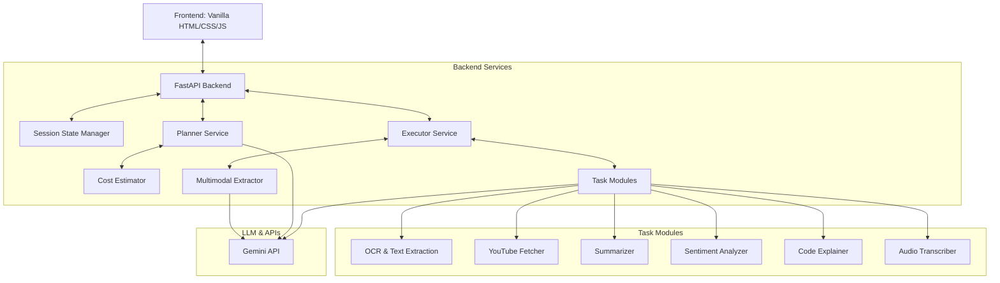

# Antigravity Multimodal Agent

An agentic application that accepts Text, Images, PDFs, or Audio files, extracts content, understands the user's intent, and autonomously performs the correct task. It separates planning from execution, estimates token and API costs, implements mandatory follow-up questions for ambiguous requests, and features a premium glassmorphic chat-like dashboard.

## 🚀 Key Features

* **Multimodal Extraction**:
  * **Text**: Standard text queries.
  * **Images (PNG, JPG)**: OCR utilizing Gemini API's vision capabilities.
  * **PDFs**: Native text extraction with `PyMuPDF`. Automatically falls back to page-by-page OCR rendering if the PDF is scanned.
  * **Audio (MP3, WAV, M4A)**: Speech-to-Text with quality confidence score and estimated audio duration.
* **Agentic Planner & Executor Split**:
  * **Planner**: Resolves intent ambiguity and outlines a structured step-by-step plan.
  * **Executor**: Runs tasks sequentially, logging operations in real-time.
* **Mandatory Follow-Up Question Rule**:
  * The agent will not guess if an input or file is provided without clear instructions. It pauses execution, returns a clarifying question to the user, and resumes once clarified.
* **Plan Cost Estimator**:
  * Prior to execution, the agent calculates estimated token usage and API costs based on standard model pricing.
* **Autonomous Task Capabilities**:
  * Image/PDF text extraction (clean text + confidence score).
  * YouTube Transcript Fetching (URL regex matching + YouTube Transcript API scraping).
  * Conversational Answering.
  * Summarization (1-line, 3 bullets, and 5-sentence formats).
  * Sentiment Analysis (Label, confidence score, and one-line justification).
  * Code Explanation (Code summary, syntax/vulnerability detection, and Big-O time/space complexity analysis).
  * Audio transcription + summarization (transcription + 3 summary formats + duration).
* **Premium Glassmorphic UI**:
  * Sleek dark mode dashboard built with vanilla CSS and HSL colors.
  * Real-time scrolling execution log terminal.
  * Collapsible extracted file text viewer and markdown-formatted output container.

---

## 🛠️ System Architecture



---

## 💻 Setup & Installation

### 1. Prerequisites
Ensure you have **Python 3.10+** installed on your system.

### 2. Clone/Copy Code and Install Dependencies
Navigate to the directory and install dependencies:
```bash
pip install -r requirements.txt
```

### 3. Configure Environment Variables
Create a `.env` file in the root directory (based on `.env.example`):
```env
GEMINI_API_KEY=your_real_gemini_api_key_here
```

### 4. Run the Application
Start the FastAPI server using Uvicorn:
```bash
python -m uvicorn app.main:app --reload
```
Once running, open your browser and navigate to:
👉 **[http://127.0.0.1:8000](http://127.0.0.1:8000)**

---

## 🧪 Running Tests

A comprehensive suite of unit tests is included. Run it offline using `pytest`:
```bash
python -m pytest
```

---

## 📡 API Endpoints

### 1. Send Prompt & File (`POST /api/chat`)
Creates a session, parses the uploaded file, plans tasks, and runs execution if ready.
* **Form Parameters**:
  * `query` (optional string): User prompt text.
  * `file` (optional binary): File attachment (PDF, PNG, JPG, JPEG, MP3, WAV, M4A).
* **Returns**: JSON object of current `SessionState`.

### 2. Submit Clarification (`POST /api/respond`)
Responds to a follow-up question in an ambiguous session.
* **Form Parameters**:
  * `session_id` (string): Target session ID.
  * `clarification` (string): User reply clarifying intent.
* **Returns**: JSON object of current `SessionState`.

### 3. Check Session Status (`GET /api/status/{session_id}`)
Checks background progress, logs, and output results.
* **Returns**: JSON object of current `SessionState`.
